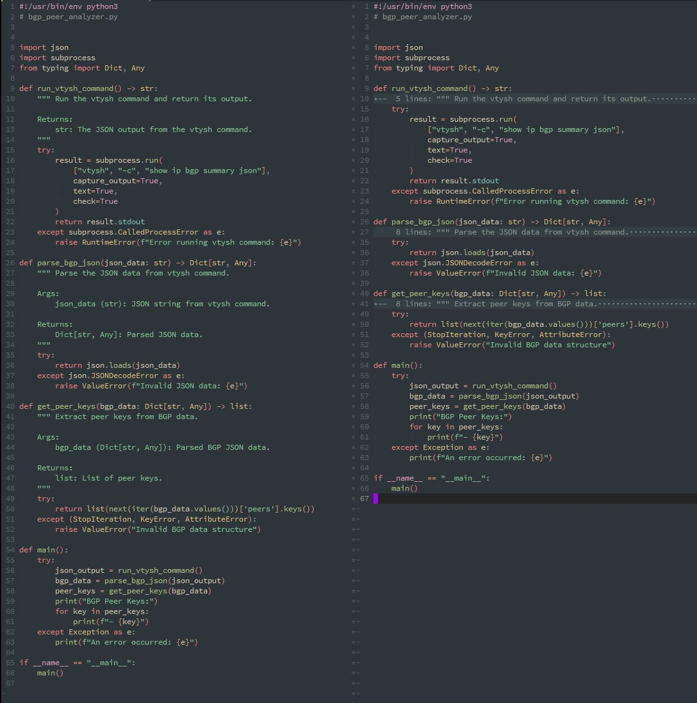

# PyDocHide Plugin for Neovim

## Overview
PyDocHide is a plugin for Neovim that automatically hides Python docstrings in a file, making it easier to read and navigate the code. This plugin uses Tree-sitter to parse the Python code and identify docstrings, which are then folded away.

## Features
- Automatically hides Python docstrings when a Python file is opened
- Uses Tree-sitter to parse the Python code and identify docstrings
- Folds docstrings away, making it easier to read and navigate the code
- Can be run manually using the :PyDocHide command



## Install

1. Install [Neovim](https://neovim.io/)

2. Install Plugin
If you use [pathogen](https://github.com/tpope/vim-pathogen) just clone to your bundle.  
or  
If you use [vim-plug](https://github.com/junegunn/vim-plug) add the following to your ~/.confg/nvim/init.vim file:
`Plug 'camAtGitHub/pydochide.nvim'`
Then restart NeoVim or run `:source $MYVIMRC` and run `:PlugInstall`.

## Usage

This vim plugin defines one command which is auto-loaded:

`:PyDocHide` which can be used to manually redraw the folds, hiding the docstrings.

Additionally the following autocmd is created to automatically hide the docstrings when a Python file is opened:
```vim
autocmd FileType python PyDocHide
```
Use the following vim commands to manipulate the folded docstrings.

* `za`: Toggle current fold.
* `zo`: Open the current fold.
* `zc`: Close the current fold.


### Credits
- This plugin is based on the [vim-pydocstring](https://github.com/yhat/vim-docstring) plugin by yhat.  
- Thanks to OpenAI and the `o1-mini` model for writing the whole thing in lua from the original python code.

### License
MIT

### Metadata
```yaml
Tags: python, docstring, tree-sitter, neovim
```
